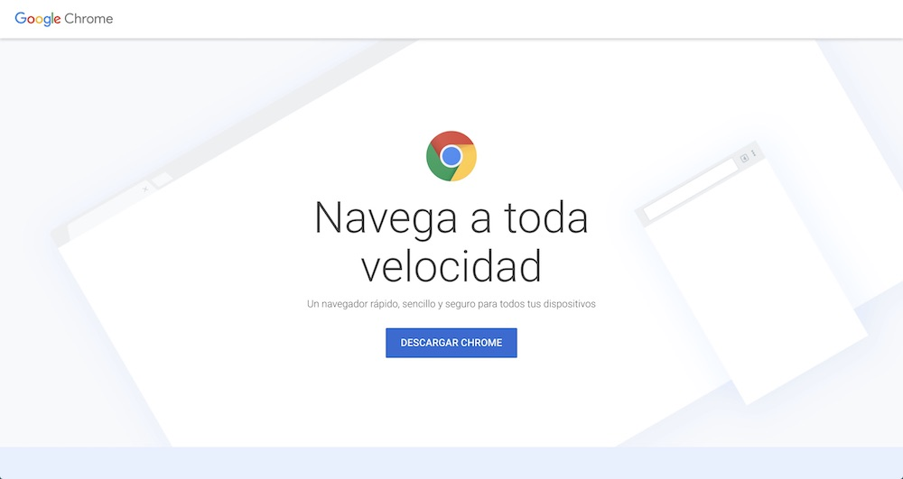
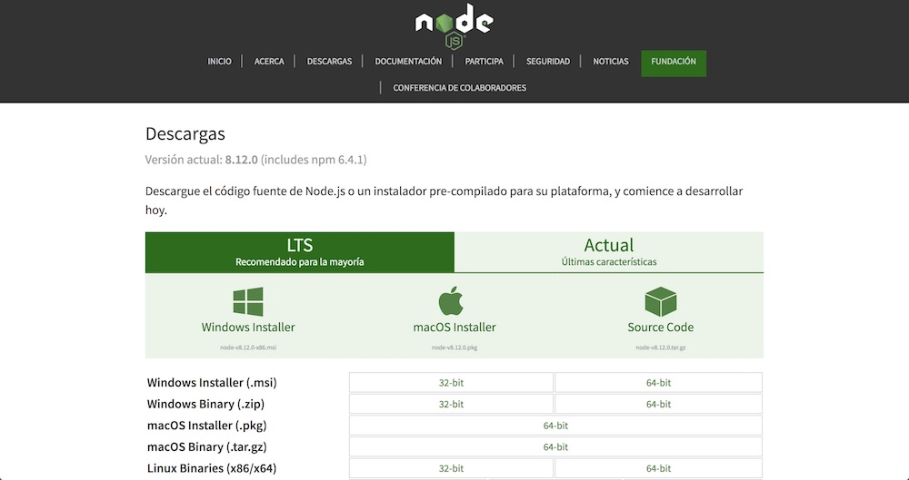

# 1. Configurando el ambiente ⚙

Antes de arrancar, se necesitan tener las herramientas instaladas. No hay restricciones con respecto al sistema operativo (_Windows, Linux o Mac_).
En cuanto al browser, muchas de las funcionalidades podrán ser construídas y utilizadas en todos los browsers modernos aunque usaremos Chrome para asegurar tener la misma experiencia en el transcurso del workshop y porque sabemos que tiene disponibles todas las funcionalidades que utilizaremos. 

Se requiere instalar **node.js** y **npm**. Aparte de estas herramientas, se necesita un editor de texto o IDE web (_Visual Studio Code, Sublime, Atom, Vim, Webstorm, etc._). 

A continuación, se explica cómo instalar alguna de ellas.

## Instalar Chrome última versión

El workshop se basa en estándares web que para el momento de creación del mismo no estaban completamente implementadas en todos los browsers. Por eso, más la posibilidad de tener la misma experiencia en todos los sistemas operativos, agregamos como prerrequisito tener la última versión de Chrome instalada. Hay que aclarar que nada de lo que hagamos no impedirá que el sitio funcione en los browsers que no tengan soporte para alguna funcionalidad.

1. Navegar a [https://www.google.com/chrome/](https://www.google.com/chrome/) y descargar la versión correspondiente para tu plataforma.

    

    _Sitio de Chrome_

1. Una vez descargado, seguir los pasos de la instalación.

## IDE / Editor. Ejemplo Visual Studio Code

Para editar el código, se va a aprovechar _Visual Studio Code_, en especial porque permite trabajar en todas las plataformas y es gratuito. Igualmente, se puede usar su editor de texto o IDE preferido.

1. Navegar a [https://code.visualstudio.com](https://code.visualstudio.com) y descargar la versión correspondiente para tu plataforma.

    

    _Sitio de Visual Studio Code_

1. Una vez descargado, seguir los pasos de la instalación.

## Node.js & npm

Hoy en día existen muchas herramientas para el desarrollo web que aprovechan [node.js](https://nodejs.org) y [npm](https://www.npmjs.com). Por más que no es requerido para el desarrollo de una PWA, nosotros usaremos algunas de estas herramientas y por eso es un requerimiento de este workshop. El primero sirve para poder correr las herramientas necesarias. El segundo, se necesita dado que es la forma en la que se distribuyen los paquetes que utilizaremos.

> **Nota**: Verificar que está instalada al menos la versión _6.x.x_ de _node.js_ y la versión _3.x.x_ de _npm_ corriendo `node -v` y `npm -v` en la terminal/consola.

1. Navegar al sitio de descargas de _node.js_: [https://nodejs.org/es/download/](https://nodejs.org/es/download/).

    

    _Sitio de node.js_

1. Seleccionar la versión _LTS (Long term support)_ y la plataforma correspondiente.

1. Una vez descargado, seguir los pasos de la instalación.

## Conclusiones

Con este tipo de herramientas se puede desarrollar desde cualquier plataforma (Windows, Mac o Linux) sin ningún problema, permitiendo una mayor flexibilidad.

Ahora que el entorno de desarrollo está listo, no queda otra cosa que empezar a desarrollar la aplicación.

## Próximo modulo
Avanzar al [módulo 2 - Explorando el proyecto inicial 🔎](../02-proyecto)
