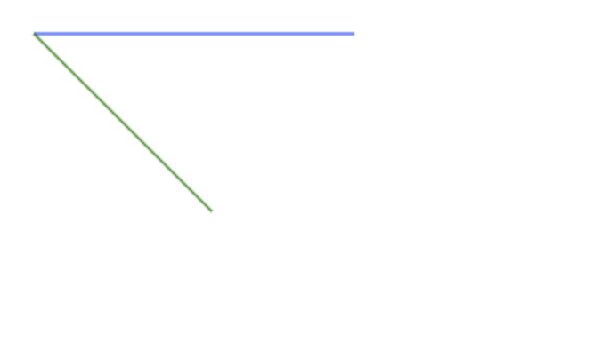

# Conceptos principales 📜
_Progressive Web App_ hace referencia a un conjunto de herramientas y buenas prácticas, algunas de ellas ya conocidas hace mucho y otras mucho más nuevas. 

Esas herramientas y buenas prácticas apuntan a que la web se comporte cada vez más parecida a una aplciación nativa. Tanto desde el comportamiento como desde las funcionalidades que nos permite desarrollar.

En este módulo veremos algunas de las herramientas y buenas prácticas que usaremos a lo largo del workshop. Otras las iremos introduciendo a medida que las vayamos necesitando.

## Progressive enhancement

Mejora progresiva (o _Progressive enhancement_) es una estrategia particular de diseño y desarrollo web que tiene como objetivo lograr que cada persona tenga acceso al contenido y a la funcionalidad básica de una página web, usando cualquier navegador web o conexión a Internet, mientras que también permite a otros con un mayor ancho de banda o un navegador web más avanzado experimentar una versión mejorada de la página.

Principios:

- Todo el contenido básico debe ser accesible a todos los browsers.
- Toda la funcionalidad básica debe ser accesible a todos los browsers.
- El código semántico contiene todo el contenido.
- Las mejoras en la disposición de los elementos son proporcionadas por el CSS linkeado externamente.
- Las mejoras en el comportamiento son proporcionadas por JavaScript linkeado externamente.
- Las preferencias del browser del usuario final son respetadas.

Un ejemplo simple para ver estos conceptos es el tag `picture` donde, en caso de no tener soporte para este tag, se cuenta con un fallback a uno más soportado como es `img`. A su vez, si el navegador no permite mostrar imágenes o no fue posible acceder a la misma al momento de carga, va a mostrar un texto alternativo gracias al atributo `alt`.

```html
<picture>
  <source media="(min-width: 800px)" srcset="head.webp" type="image/webp">
  <source media="(min-width: 800px)" srcset="head.jpg" type="image/jpeg">
  <source media="(min-width: 450px)" srcset="head-small.webp" type="image/webp">
  <source media="(min-width: 450px)" srcset="head-small.jpg" type="image/jpeg">
  
</picture>
```

_En este ejemplo vemos como en caso de no tener soporte para el formato webp se usa la imagen jpg y en caso de no tener soporte para picture se usa el img._

## Polyfill
Un polyfill es código que implementa una funcionalidad en un browser que no la soporta. En general es una librería JS que implementa un estándar web, ya sea uno establecido (no soportado por algún browser antiguo), como un estándar propuesto, no implementado en ninguno de ellos.

Los polyfills permiten usar una API sin la necesidad de que esté soportada en todos los navegadores y generalmente de una manera muy sencilla.

Generalmente, chequean si el browser soporta la API y la usan si está disponible. Si no, usan su propia implementación.

## Closures

Un closure es la combinación de una función y el ámbito en el que se declaró dicha función.

A lo largo del workshop, usaremos _closures_ para poder separar el código en módulos que no interfieran unos con otros.

Definiremos una función que actúa como contenedor para un contexto de ejecución. Esto quiere decir que en su interior, se declaran una serie de variables y funciones que solo son visibles desde dentro del mismo.

```js
// Namespace para la librería
var MyLibrary = {};
 
// Definición de la librería
MyLibrary = (function () {
  // Propiedades privadas
  var p1, p2;
 
  // Métodos privados
  function aPrivateMethod() {
  }
 
  // API pública
  return {
    publicMethod: function () {
    },
 
    anotherPublicMethod () {
    }
  }
}());
```

## Promesas

El objeto `Promise` (Promesa) es usado para computaciones asíncronas. Una promesa representa un valor que puede estar disponible ahora, en el futuro, o nunca.

La sintaxis es la siguiente.

```js
new Promise( function(resolver, rechazar) { ... } );
```

El parámetro es una función con los argumentos resolver y rechazar. Las funciones resolver y rechazar, al ser llamadas, resuelven o rechazan la promesa, respectivamente. Normalmente el ejecutor inicia un trabajo asíncrono, y luego, una vez que es completado, llama a la función resolver para resolver la promesa o la rechaza si ha ocurrido un error.
Si un error es lanzado en la función ejecutor, la promesa es rechazada y el valor de retorno del ejecutor es rechazado.

## Async / Await

La finalidad de las funciones `async/await` es simplificar el comportamiento del uso síncrono de `Promises` y realizar algún comportamiento específico en un grupo de `Promises`.

Cuando se llama a una función `async`, esta devuelve un elemento `Promise`. Una función `async` puede contener una expresión `await`, la cual pausa la ejecución de la función asíncrona y espera la resolución de la `Promise` pasada y, a continuación, reanuda la ejecución de la función `async` y devuelve el valor resuelto.

### Ejemplo

Una API que devuelva una `Promise` tendrá como resultado una cadena de promesas, y dividirá la función en muchas partes:

```js
function getProcessedData(url) {
  return downloadData(url) // devuelve una promise
    .catch(e => {
      return downloadFallbackData(url)  // devuelve una promise
    })
    .then(v => {
      return processDataInWorker(v); // devuelve una promise
    });
}
```

Este código se puede reescribir utilizando un solo operador `async` de esta manera:

```js
async function getProcessedData(url) {
  let v;
  try {
    v = await downloadData(url); 
  } catch(e) {
    v = await downloadFallbackData(url);
  }
  return processDataInWorker(v);
}
```

## Fetch

La `API Fetch` proporciona una interfaz para recuperar recursos (incluyendo recursos remotos a través de redes). Le resultará familiar a cualquiera que haya usado `XMLHttpRequest`, pero esta nueva API ofrece un conjunto de características más potente y flexible.

`Fetch` ofrece una definición genérica de los objetos `Request` y `Response`.

## WebSockets

WebSockets es una tecnología que permite abrir una sesión de comunicación interactiva entre el navegador del usuario y un servidor. Con esta  API, podemos enviar mensajes a un servidor y recibir respuestas controladas por eventos sin tener que consultar al servidor para una respuesta.

Nuestro chat va a hacer uso de WebSockets para recibir y enviar mensajes desde y hacia el servidor.

### Herramientas
Existen varias herramientas que facilitan su integración. Entre ellas:
- Socket.IO: Una poderosa API WebSocket multi-plataforma para Node.js.
- WebSocket-Node: Un servidor WebSocket para Node.js.

Como vimos antes, en nuestro caso usaremos [websocket.](https://www.npmjs.com/package/websocket) Una implementación muy sencilla para construir nuestro servidor en node.

### Soporte
El soporte nativo en navegadores es actualmente [muy bueno.](https://caniuse.com/#feat=websockets)
Eso facilita su integración y es el motivo por el cual no usaremos ningún polyfill.


## Canvas
Añadido en HTML5, el tag `<canvas>` se puede usar para dibujar gráficos mediante JavaScript. Por ejemplo, se puede usar para hacer gráficos, composiciones fotográficas, crear animaciones, o incluso procesado o renderizado de vídeo en tiempo real.

Durante el workshop vamos a usarlo para procesar imágenes y audio, por eso es importante entender su funcionamiento básico.

### Intro a canvas

#### El tag
```html 
<canvas id="tutorial" width="150" height="150"></canvas>
```

A primera vista, el tag `<canvas>` se ve como un tag `` tradicional con la diferencia de no tener atributos de `src` y `alt`.
 
`<canvas>` tiene solo dos atributos. `height` y `width`. Los dos son opcionales pero, si no se especifican, el canvas tendrá 300 píxeles de ancho y 150 de alto por defecto.

Se puede dimensionar vía CSS pero, al renderizar una image, la misma se escalará al tamaño del layout. Así que, si el tamaño dado por CSS no respeta la relación de aspecto inicial, se verá distorcionada.

Se puede estilizar como cualquier imagen _(margin, border, background, etc.)_. Esas reglas no afectarán el dibujado en el canvas.

#### El `rendering context`
El elemento `<canvas>` crea una superficie de dibujo de tamaño fijo que expone uno o más `rendering context` que son usados para crear y manipular el contenido mostrado.

El canvas inicialmente está en blanco. Para mostrar algo, primero debemos acceder al `rendering context` y dibujar en él. El elemento `<canvas>` tiene un método llamado `getContext()` que se usa para obtener el `rendering context` y sus funciones para dibujar. 

`getContext()` recibe el tipo de contexto como parámetro. Para gráficos 2D, debemos especificar `"2d"` y obtendremos un `CanvasRenderingContext2D`.

##### Ejemplo
Primero obtenemos el canvas y luego accedemos a su `rendering context` llamando al método `getContext()`.

```js
var canvas = document.getElementById('canvas');
var ctx = canvas.getContext('2d');
```

#### Dibujando
Como decíamos, el canvas comienza vacío. Es nuestro lienzo listo para dibujar. Para eso, el `rendering context` nos brinda un conjunto de herramientas. 

[Acá](https://developer.mozilla.org/en-US/docs/Web/API/CanvasRenderingContext2D) se pueden ver todos los métodos disponibles en CanvasRenderingContext2D.

A continuación detallamos algunas de las que vamos a usar durante el workshop:

##### drawImage
Nos provee 3 maneras diferentes de dibujar una imagen en el canvas.

```js
ctx.drawImage(image, dx, dy);
ctx.drawImage(image, dx, dy, dWidth, dHeight);
ctx.drawImage(image, sx, sy, sWidth, sHeight, dx, dy, dWidth, dHeight);
```

En la imagen se puede ver qué representa cada uno de los parámetros:


_Explicación de parámetros de drawImage_

##### fillRect
Permite dibujar un rectángulo lleno. Para el cual, el punto de inicio son las cordenadas _(x,y)_, el ancho y el alto son especificados como _width_ y _height_ y el estilo está determinado por el atributo `fillStyle`.

Por ejemplo, el siguiente código genera lo que vemos en la imagen inferior.

```js
ctx.fillStyle = 'green';
ctx.fillRect(10, 10, 100, 100);
```


_Ejemplo de fillRect_

##### beginPath

Comienza una nueva ruta y vacía la lista de subrutas.

```js
// Primera ruta
ctx.beginPath();
ctx.strokeStyle = 'blue';
ctx.moveTo(20, 20);
ctx.lineTo(200, 20);
ctx.stroke();

// Segunda ruta
ctx.beginPath();
ctx.strokeStyle = 'green';
ctx.moveTo(20, 20);
ctx.lineTo(120, 120);
ctx.stroke();
```

Va a generar la siguiente ruta:



_Ejemplo de beginPath_
 
##### putImageData

Pinta los datos del objeto ImageData que le pasamos.

```js
ctx.putImageData(imageData, 0, 0);
```

##### rect

Crea una ruta para un rectángulo en la posición _(x, y)_ con el tamaño determinado por width y height. Esos cuatro ountos se conectan por líneas rectas y esa ruta se marca como cerrada, lo que permite dibujar el borde o rellenar su interior.

```js
ctx.rect(10, 10, 100, 100);
ctx.fill();
```

##### toDataURL

Por último, un método que es del elemento `canvas` y no del `rendering context` es `toDataURL`.

Nos permite obtener una DataURI que representa la imagen del contenido del canvas. 

```js
canvas.toDataURL(type, options);
```

Las 2 opciones son opcionales.


### Progressive enhancement
Si bien el soporte en navegadores es bueno, como decíamos antes, nunca está de más asegurarnos de que todos puedan tener acceso a nuestra funcionalidad.

Generar un fallback es muy sencillo: simplemente insertar contenido dentro del elemento `<canvas>`.
 
Los browsers que no lo soporten, ignorarán el tag y mostrarán el fallback del interior. Los que sí lo soporten harán de cuenta como que ese contenido no existe.

##### Ejemplo
Podemos mostrar el contenido del gráfico como texto o una imagen de esa animación que el usuario no podrá ver.

```html
<canvas id="stockGraph" width="150" height="150">
  Precio actual de la acción: $3.15 + 0.15
</canvas>

<canvas id="clock" width="150" height="150">
  
</canvas>
```

### Soporte
Nuevamente, el soporte nativo en navegadores es afortunadamente, [muy bueno.](https://caniuse.com/#feat=canvas)

Existen igualmente [Polyfills](https://github.com/Modernizr/Modernizr/wiki/HTML5-Cross-Browser-Polyfills#canvas) para casos en los que tengamos que dar soporte a browsers realmente muy viejos.
